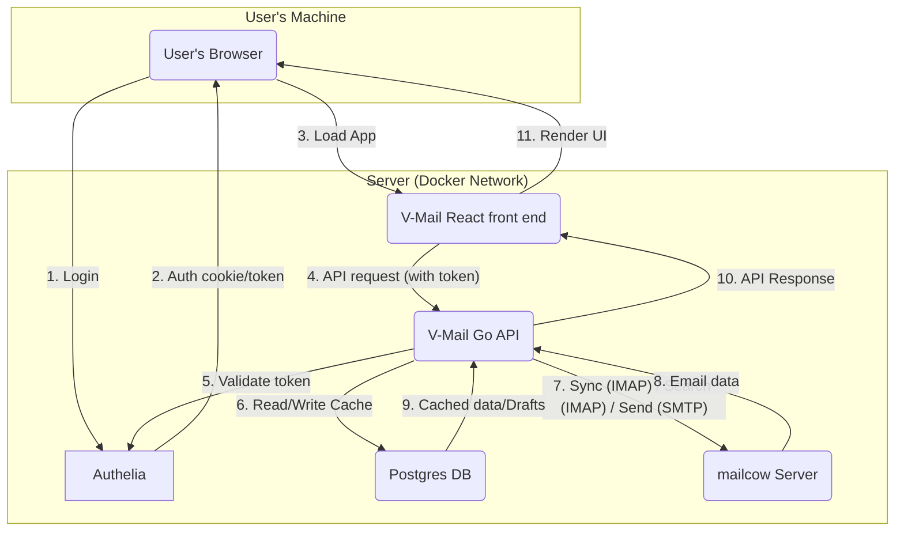

## Developing and debugging

This setup lets you run the Go backend or the React frontend (or both) locally on your machine for easier debugging,
while still using Docker to manage the database.

1. Configure your local setup. You only need to do this once.
    - Expose your database port
        - Your Go app, running on your host, needs to talk to the Postgres container.
          Create a `docker-compose.override.yaml` file to wet it up, with this content:
          ```yaml
          services:
            db:
              # This maps the container's port 5432 to your computer's port 5432
              ports:
              - '127.0.0.1:5432:5432'
          ```
2. Run the backend locally
    - Use `docker compose up -d db`
    - Edit your `.env` file: Change `VMAIL_DB_HOST` to point to `localhost`.
3. Set up Authelia locally
    - Follow [Authelia's docs](https://www.authelia.com/docs/getting-started/installation/) to run it locally.
    - Set your `.env` file so that it points to the local Authelia instance.
      TODO Complete this

## Architecture

Here are some clues that should help you get started.

### Component interaction diagram

Here is a high-level overview of the interaction between V-Mail's components:



## Back end

The back end is a **Go** application providing a **REST API** for the front end.
It communicates with the IMAP and the SMTP server and uses a **Postgres** database for caching and internal storage.

### Features

* Serves the front end via `http.FileServer`
* Validates JWTs from Authelia
* Validates user credentials in the DB
* Pools IMAP connections
* Uses IMAP commands: `SELECT`, `FETCH`, `THREAD`, `SEARCH`, `STORE`, `APPEND`, `COPY`
* Provides a helper function for generating an encryption key for AES-GCM encryption.
* Uses IMAP's IDLE command as per [RFC 2177](https://datatracker.ietf.org/doc/html/rfc2177). Runs a goroutine
  for each active user to get notified as soon as an email arrives.
* Maintains a connection pool to the IMAP server, making sure connections exist at all times.
  We need two types of connections for each active user:
    * **The "Worker" Pool:** A pool of 1–3 "normal" connections used by the API handlers to run `SEARCH`, `FETCH`,
      `STORE` (star, archive), and so on. These are for short-lived commands.
    * **The "Listener" Connection:** A single, dedicated connection per user that runs in its own persistent goroutine.
      Its only job is to log in, `SELECT` `Inbox`, and run the `IDLE` command.
        * If this connection drops (which it will, due to network timeouts), the `client.Idle()` command in the
          goroutine returns an error. The code catches this error, logs it,
          waits 5–10 seconds (uses exponential backoff), and then reconnects and re-issues the IDLE command.
* Provides WebSocket connections for clients for email push. When the IDLE goroutine gets a push, it finds
  the user's WebSocket connection and sends a JSON message like `{"type": "new_email", "folder": "Inbox"}`.

### DB design

We chose **Postgres** for its robustness, reliability, and excellent support for `JSONB`,
which is useful for flexible payloads (like our action queue).

The DB's role is **not** to be a full, permanent copy of the mailbox. Its primary roles are:

* Caching thread/message metadata for a fast UI.
* Storing user settings and their **encrypted** IMAP/SMTP credentials.
* Saving drafts.
* Queuing actions (like "Undo Send" or offline operations).

### Go libraries used

* **IMAP Client:** [`github.com/emersion/go-imap`](https://github.com/emersion/go-imap)
    * This seems to be the *de facto* standard library for client-side IMAP in Go.
      It seems well-maintained and supports the necessary extensions like `THREAD`.
* **MIME Parsing:** [`github.com/jhillyerd/enmime`](https://github.com/jhillyerd/enmime)
    * The Go standard library is not enough for real-world, complex emails.
    * `enmime` robustly handles attachments, encodings,
      and HTML/text parts. [Docs here.](https://pkg.go.dev/github.com/jhillyerd/enmime)
* **SMTP Sending:** Standard `net/smtp` (for transport)
  with [`github.com/go-mail/mail`](https://github.com/go-mail/mail)
    * `net/smtp` is the standard library for sending.
    * `go-mail` is a popular and simple builder library for composing complex emails (HTML and attachments)
      that `net/smtp` can then send.
* **HTTP Router:** [`http.ServeMux`](https://pkg.go.dev/net/http#ServeMux)
    * It's part of the Go standard library, is battle-tested and well-documented.
    * Selected based on [this guide](https://www.alexedwards.net/blog/which-go-router-should-i-use)
* **Postgres Driver:** [`github.com/jackc/pgx`](https://github.com/jackc/pgx)
    * The modern, high-performance Postgres driver for Go. We need no full ORM (like [GORM](https://gorm.io/))
      for this project.
* **Encryption:** Standard `crypto/aes` and `crypto/cipher`
    * For encrypting/decrypting user credentials in the DB using AES-GCM.
* **Testing:** [`github.com/ory/dockertest`](https://github.com/ory/dockertest)
    * Useful for integration tests to spin up real Postgres containers.

### Test plan

* **Unit tests (Go `testing` package):**
    * **`imap` package:** Mock the IMAP server connection.
        * Test `TestParseThreadResponse`: Feed it a sample `* (THREAD ...)` string and assert that it builds
          the correct Go struct tree.
        * Test `TestBuildSearchQuery`: Feed it `"from:george after:2025"` and assert it creates the correct IMAP
          `SEARCH` query string.
    * **`api` package:** Use `httptest` to test handlers. Mock the `imap` and `db` services.
        * Test `TestGetThreadsHandler`: Send a mock request and ensure it calls the `imap` service and returns
          the correct JSON.
* **Integration tests:**
    * Use `testcontainers-go` to spin up a **real Postgres DB** for tests.
    * Test the full flow: `api handler -> db package -> test postgres DB`.
    * Example: "Call the draft saving endpoint and then query the test DB to ensure the draft was written correctly."

## Front end

### Tech

* **Framework:** React 19+, with functional components and hooks.
* **Language:** TypeScript, using no classes, just modules.
* **Styling:** Tailwind 4, utility-first CSS.
* **Package manager:** pnpm.
* **State management:**
    * `TanStack Query` (React Query): For server state (caching, invalidating, and refetching all data from our Go API).
    * `Zustand`: For simple, global UI state (e.g., current selection, composer open/closed).
* **Routing:** `react-router` (for URL-based navigation, e.g., `/inbox`, `/thread/id`).
* **Linting/Formatting:** ESLint and Prettier.
* **Testing:**
    * `Jest` + `React Testing Library`: For unit and integration tests.
    * `Playwright`: For end-to-end tests.
* **Security:** [`DOMPurify`](https://github.com/cure53/DOMPurify)
    * To sanitize all email HTML content before rendering it with `dangerouslySetInnerHTML`.
      This is a **mandatory** security step.

### Features

* Onboarding
    * Problem: When a user first logs in via Authelia, the API will validate their token, but `users` is empty for them.
      The API has no IMAP settings to use. The app is unusable.
    * Solution:
        * Go's "get user" endpoint returns a `not_set_up` flag (or `null` if that's unidiomatic).
        * The front end redirects to `/settings`.
        * This page has fields for: IMAP Host, IMAP User, IMAP Password, SMTP Host, SMTP User, SMTP Password,
          Undo Send Delay (20s), Pagination Threads Per Page (100).
        * The back end encrypts the data and creates the `users` and `user_settings` records.
* IMAP email loading and SMTP sending/replying.
* WebSocket-based real-time email fetching
    * The app opens a WebSocket connection to the API.
      When the front end gets a message like `{"type": "new_email", "folder": "Inbox"}`, it invalidates
      the TanStack Query cache for the inbox, triggering TanStack Query to GET `/api/v1/threads?folder=Inbox`.
      The new email appears almost instantly.
* Threaded view with thread-count display, such as `Sender Name (3)`. The server does the threading itself.
* Search. Including some Gmail-like syntax, for example `from:george after:2025`. Search itself happens on the server.
* Pagination (100 emails/page).
* Star, Archive, Trash actions.
* Multi-select with checkboxes.
* "Undo send" (20-second delay).
* Auto-saving drafts.
* Basic offline support (read-only cache of viewed emails via `TanStack Query` persistence).
* Periodic auto-sync and connection status indicator.
* Settings page.
    * Has fields for: IMAP Host, IMAP User, IMAP Password, SMTP Host, SMTP User, SMTP Password, Undo send delay,
      Pagination: threads per page.
* URL-based routing.
* Keyboard shortcuts.
* Logout.

### UI

* **Main layout:** Functionally similar to Gmail but aesthetically distinct (fonts, colors, logos).
* **Top:** Persistent search bar.
* **Left sidebar:** Main navigation links:
    * `Inbox`
    * `Starred`
    * `Sent`
    * `Drafts`
    * `Spam`
    * `Trash`
* **Bottom:** Footer placeholder (e.g., "Copyright 2025 V-Mail").
* **Email list view:** A paginated list of email threads. Each row shows: checkbox, star icon, sender(s), subject,
  thread count, date.
* **Email thread view:** Replaces the list view when the user clicks a thread.
  Shows all messages in the thread, expanded. Displays attachments and Reply/Forward actions.

### Test plan

* **Unit tests (Jest + React Testing Library):**
    * Test all simple, reusable components (e.g., `Button`, `Checkbox`).
    * Test all utility functions (e.g., date formatting, search query parsing).
    * Test custom hooks in isolation (e.g., `useKeyboardShortcuts`).
* **Integration tests (React Testing Library):**
    * Test feature flows by mocking the API layer (`msw` or `jest.mock`).
    * "Selecting three emails and pressing 'e' calls `api.archive` with the three correct IDs."
    * "Typing in the composer and pausing triggers the `api.saveDraft` mock."
    * "Loading the Inbox page displays a list of three emails returned from the `api.getThreads` mock."
* **End-to-end tests (Playwright):**
    * Test the *full*, running application.
    * "User can log in (mocking Authelia), see the inbox, click an email, click 'Reply', type 'Test', click 'Send',
      and then find that email in the 'Sent' folder."

## Deployment

With Docker.

## Style guide

Writing and code styles.

### Writing

- Wording
    - **Use a friendly style**: Make all texts informal, friendly, encouraging, and concise.
    - **Use active voice**: Prefer an active voice rather than passive when writing text.
    - **Abbreviate English**: Use "I'm", "don't", and such.
    - **Don't trivialize**: Avoid the terminology of "just", "simple", "easy", and "all you have to do".
    - **Use gender-neutral language**: Use they/them rather than he/him/she/her. Use "folks" or "everyone"
      rather than "guys".
    - **Use universally understood terms**: Use "start" instead of "kickoff", and "end" instead of "wrap up".
    - **Avoid ableist language**: "placeholder value" rather than "dummy value". No "lame", "sanity check" which derive
      from disabilities.
    - **Avoid violent terms**: "stop a process" rather than "kill" or "nuke" it.
    - **Avoid exclusionary terminology**: Prefer "primary/secondary" or "main/replica" over "master/slave". Use
      "allowlist/denylist" over "whitelist/blacklist".
    - **Be mindful of user expertise**: Avoid jargon. Link to definitions and explain concepts when necessary.
    - **Avoid latinisms**: For example, use "for example" instead of "e.g.".
    - **Avoid abbreviations**: Very common acronyms like "URL" are okay.
- Punctuation, capitalization, numbers
    - **Use sentence case in titles**: Regardless whether visible on the UI or dev only.
    - **Use sentence case in labels**: Applies to buttons, labels, and similar. But omit periods on short microcopy.
    - **Capitalize names correctly**: For example, there is GitHub but mailcow.
    - **Use the Oxford comma**: Use "1, 2, and 3" rather than "1, 2 and 3".
    - **Spell out numbers one through nine.** Use numerals for 10+.
    - **Use ISO dates**: Use YYYY-MM-DD wherever it makes sense.
- UI
    - Make **error messages** positive, actionable, and specific.
    - **Start UI actions with a verb**: This makes buttons and links more actionable.
      Use "Create user" instead of "New user".
    - **Give examples in placeholder text**: Use "Example: 2025-01-01" or "name@example.com" rather than an instruction
      like "Enter your email".

### TypeScript

Prettier config used:
`{"tabWidth": 4,"useTabs": false,"semi": false,"singleQuote": true,"quoteProps": "as-needed","jsxSingleQuote": false,"trailingComma": "all","bracketSpacing": true,"bracketSameLine": false,"arrowParens": "always","endOfLine": "lf","printWidth": 100,"proseWrap": "always"}`.

## Designs

This section contains design pieces. They are temporary artifacts for building the projects, will be removed as we
build.

### Deployment

#### High-level folder structure

```
/
├── backend/
│   ├── cmd/server/main.go
│   ├── internal/
│   └── go.mod
├── frontend/
│   ├── src/
│   ├── package.json
│   └── pnpm-lock.yaml
└── Dockerfile
```

### Back end

#### Directory structure

```
/backend
├── /cmd/
│   └── /server/
│       └── main.go           # Main entry point
├── /internal/
│   ├── /api/                 # HTTP Handlers & routing
│   │   ├── routes.go
│   │   ├── middleware.go
│   │   └── thread_handler.go
│   ├── /auth/                # Middleware for validating Authelia JWTs
│   ├── /config/              # Config loading (env vars, etc.)
│   ├── /db/                  # Postgres logic (pgx)
│   ├── /imap/                # Core IMAP service logic
│   │   ├── client.go         # Wrapper around go-imap
│   │   ├── thread.go         # Logic for THREAD command
│   │   └── search.go         # Logic for SEARCH command
│   ├── /models/              # Core structs (Thread, Message, User)
│   └── /sync/                # Logic for background jobs, action_queue
├── /pkg/                     # (Optional) Any code you might share
├── go.mod
├── go.sum
└── Dockerfile
```

#### DB Schema

```postgresql
-- Stores the V-Mail user and their encrypted IMAP/SMTP credentials
-- Records in this table answer the question "Who is this user?".
CREATE TABLE "users"
(
    "id"         UUID PRIMARY KEY     DEFAULT gen_random_uuid(),

    "email"      TEXT        NOT NULL UNIQUE, -- The user's login email from Authelia

    "created_at" TIMESTAMPTZ NOT NULL DEFAULT now(),
    "updated_at" TIMESTAMPTZ NOT NULL DEFAULT now()
);

-- User-specific settings for the V-Mail app.
-- Is in 1:1 relation with "users".
-- Records here answer the question "What are this user's preferences and credentials for this app?".
CREATE TABLE "user_settings"
(
    "user_id"                     UUID PRIMARY KEY REFERENCES "users" ("id") ON DELETE CASCADE,

    "undo_send_delay_seconds"     INT         NOT NULL DEFAULT 20,
    "pagination_threads_per_page" INT         NOT NULL DEFAULT 100,

    "imap_server_hostname"        TEXT        NOT NULL,
    "imap_username"               TEXT        NOT NULL,
    "encrypted_imap_password"     BYTEA       NOT NULL, -- Encrypted using AES-GCM with an encryption key from an env var
    "smtp_server_hostname"        TEXT        NOT NULL,
    "smtp_username"               TEXT        NOT NULL,
    "encrypted_smtp_password"     BYTEA       NOT NULL, -- Encrypted using AES-GCM with an encryption key from an env var
    "archive_folder_name"         TEXT        NOT NULL DEFAULT 'Archive',
    "sent_folder_name"            TEXT        NOT NULL DEFAULT 'Sent',
    "drafts_folder_name"          TEXT        NOT NULL DEFAULT 'Drafts',
    "trash_folder_name"           TEXT        NOT NULL DEFAULT 'Trash',
    "spam_folder_name"            TEXT        NOT NULL DEFAULT 'Spam',

    "created_at"                  TIMESTAMPTZ NOT NULL DEFAULT now(),
    "updated_at"                  TIMESTAMPTZ NOT NULL DEFAULT now()
);

-- Caches the thread metadata for fast UI loading
CREATE TABLE "threads"
(
    "id"               UUID PRIMARY KEY DEFAULT gen_random_uuid(),

    "user_id"          UUID NOT NULL REFERENCES "users" ("id") ON DELETE CASCADE,

    -- This is the stable ID, typically the 'Message-ID' header of the root message.
    "stable_thread_id" TEXT NOT NULL,

    "subject"          TEXT,

    UNIQUE ("user_id", "stable_thread_id")
);

-- Caches individual messages belonging to a thread
CREATE TABLE "messages"
(
    "id"                UUID PRIMARY KEY DEFAULT gen_random_uuid(),

    "thread_id"         UUID    NOT NULL REFERENCES "threads" ("id") ON DELETE CASCADE,
    "user_id"           UUID    NOT NULL REFERENCES "users" ("id") ON DELETE CASCADE,

    "imap_uid"          BIGINT  NOT NULL,              -- Only unique within a folder
    "imap_folder_name"  TEXT    NOT NULL,-- "INBOX", "Sent", etc.

    "message_id_header" TEXT    NOT NULL,              -- The <...@...> header
    "from_address"      TEXT,
    "to_addresses"      TEXT[],
    "cc_addresses"      TEXT[],
    "sent_at"           TIMESTAMPTZ,
    "subject"           TEXT,
    "unsafe_body_html"  TEXT,                          -- Stored raw, sanitized on the client
    "body_text"         TEXT,

    "is_read"           BOOLEAN NOT NULL DEFAULT false,-- From \Seen flag
    "is_starred"        BOOLEAN NOT NULL DEFAULT false,-- From \Flagged flag

    UNIQUE ("user_id", "imap_folder_name", "imap_uid")
);

-- Stores metadata about attachments
CREATE TABLE "attachments"
(
    "id"         UUID PRIMARY KEY DEFAULT gen_random_uuid(),

    "message_id" UUID    NOT NULL REFERENCES "messages" ("id") ON DELETE CASCADE,

    "filename"   TEXT    NOT NULL,
    "mime_type"  TEXT    NOT NULL,
    "size_bytes" BIGINT  NOT NULL,
    "is_inline"  BOOLEAN NOT NULL DEFAULT false,
    "content_id" TEXT -- The <Content-ID> header, if present
);

-- For auto-saving drafts
CREATE TABLE "drafts"
(
    "id"                     UUID PRIMARY KEY     DEFAULT gen_random_uuid(),

    "user_id"                UUID        NOT NULL REFERENCES "users" ("id") ON DELETE CASCADE,
    "in_reply_to_message_id" TEXT, -- 'Message-ID' header of the email being replied to

    "to_addresses"           TEXT[],
    "cc_addresses"           TEXT[],
    "bcc_addresses"          TEXT[],
    "subject"                TEXT,
    "body_html"              TEXT,
    "last_saved_at"          TIMESTAMPTZ NOT NULL DEFAULT now()
);

-- For "Undo Send" and queuing offline actions
CREATE TABLE "action_queue"
(
    "id"          UUID PRIMARY KEY     DEFAULT gen_random_uuid(),

    "user_id"     UUID        NOT NULL REFERENCES "users" ("id") ON DELETE CASCADE,

    "action_type" TEXT        NOT NULL, -- 'send_email', 'archive_thread', 'mark_read'

    -- Flexible payload for the action
    "payload"     JSONB       NOT NULL,

    "created_at"  TIMESTAMPTZ NOT NULL DEFAULT now(),
    "process_at"  TIMESTAMPTZ NOT NULL  -- For 'send_email', set to NOW() + 20s
);
```

#### APIs

##### REST API

**Base path:** `/api/v1`

**Thread ID:** The `thread_id` we use in the API (e.g., `/api/v1/thread/{thread_id}`) is a stable,
unique identifier, such as the `Message-ID` header of the root/first message in the thread.

* `GET /folders`: List all IMAP folders (Inbox, Sent, etc.).
* `GET /threads?folder=Inbox&page=1&limit=100`: Get paginated threads for a folder.
* `GET /threads/search?q=from:george&page=1`: Get paginated search results.
* `GET /thread/{thread_id}`: Get all messages and content for one thread.
* `GET /message/{message_id}/attachment/{attachment_id}`: Download an attachment.
* `GET /settings`: Get user settings.
* `POST /send`: Send a new email (places in `action_queue` for "Undo Send").
* `POST /drafts`: Create or update a draft.
* `POST /actions`: Perform bulk actions.
    * Body: `{"action": "archive", "thread_ids": ["id1", "id2"]}`
    * Body: `{"action": "mark_read", "message_ids": ["id3"]}`
    * Body: `{"action": "star", "thread_ids": ["id1"]}`
* `POST /undo`: Undo the last `send` action.
* `POST /settings`: Save settings.
    * Body:
      `{"imap_host": "imap.example.com", "imap_user": "user", "imap_password": "pass", "smtp_host": "smtp.example.com", "smtp_user": "user", "smtp_password": "pass", "undo_send_delay_seconds": 20, "pagination_threads_per_page": 100}`
* `DELETE /threads`: Move threads to trash.
    * Body: `{"thread_ids": ["id1", "id2"]}`

##### Real-time API (WebSockets)

For real-time updates (like new emails), the front end will open a WebSocket connection.

* `GET /api/v1/ws`: Upgrades the HTTP connection to a WebSocket.
  The server uses this connection to push updates to the client.
    * **Server-to-client message example:**
        ```json
        {"type": "new_message", "folder": "INBOX"}
        ```

### Front end
