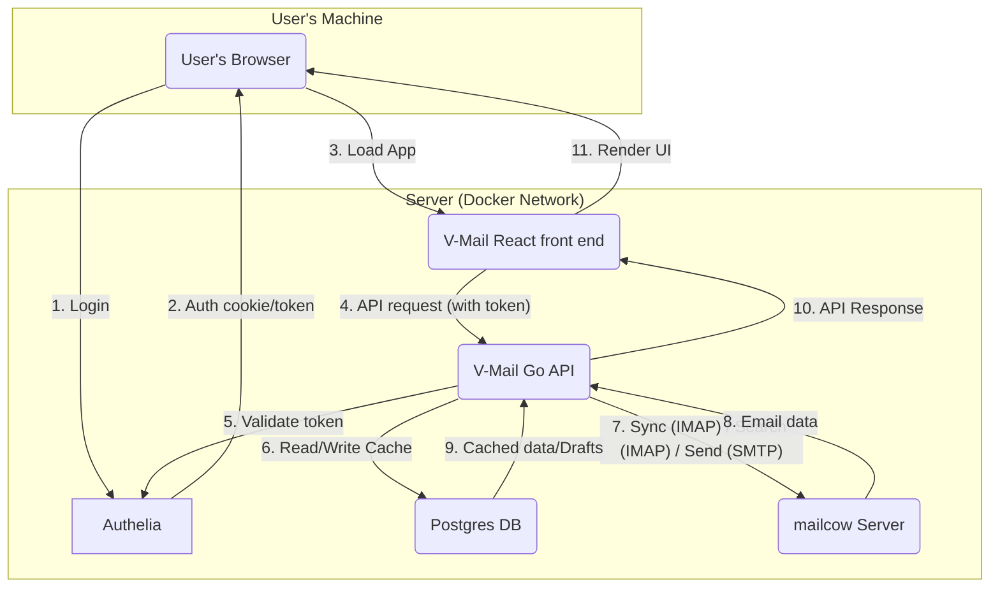

# V-Mail

A fast, self-hosted webmail client with a familiar, keyboard-driven UI.

## Overview

V-Mail is a self-hosted, web-based email client designed for personal use.
It uses the layout and keyboard shortcuts of Gmail to make it immediately familiar for ex-Gmail users.
It connects to an IMAP server (tested with mailcow) and provides the web UI to read and send email.

I built V-Mail with the explicit legal constraint to **not** use any of Google's proprietary assets (fonts, icons, logos)
or aesthetic design. The focus is on **functional parity**, not visual imitation, to avoid any brand confusion.

## Non-goals

Compared to Gmail, this project does **not** include:

* Client-side email filters. The user should set these up on the server, typically via [Sieve](http://sieve.info/).
* A visual query builder for the search box. A simple text field is fine.
* A multi-language UI. The UI is English-only.
* 95% of Gmail's settings. V-Mail has some basic settings like emails per page and undo send delay, but that's it.
* Automatic categorization such as primary/social/promotions.
* The ability to collapse the left sidebar.
* Signature management.
* Smiley/emoji reactions to emails. This is Google's proprietary thing.

## Architecture

V-Mail uses a **Go** back end, a **REST** API, and a **React** front end with **TypeScript**.
It uses a **Postgres** database for caching, drafts, and settings.
V-Mail does **not** handle authentication. A separate, self-hosted [Authelia](https://www.authelia.com) instance is responsible for that.

All components (V-Mail, Authelia, Postgres, and the mailcow IMAP server) run in **Docker** containers.
This design assumes all containers exist on the same server, communicating over a Docker bridge network.
This is not necessarily a requirement, but I've only tested it on a single-server setup.

### Component interaction diagram

Here is a high-level overview of the interaction between V-Mail's components:



## Related services

### IMAP server

V-Mail works with modern IMAP servers, **mailcow** (using Dovecot under the hood) being the primary target.
It has two **hard requirements** for the IMAP server:

1.  **`THREAD` Extension ([RFC 5256](https://datatracker.ietf.org/doc/html/rfc5256)):** Server-side threading is mandatory.
    V-Mail will not implement client-side threading.
2.  **Full-Text Search (FTS):** The server must support fast, server-side `SEARCH` commands.
    Standard IMAP `SEARCH` is part of the core protocol, but V-Mail's performance relies on the server's FTS capabilities,
    like those in Dovecot.

### Authelia

**Authelia** ([authelia.com](https://www.authelia.com/)) is responsible for authentication.
It's an [open-source](https://github.com/authelia/authelia), Go-based single sign-on (SSO) and 2FA server.

**Interaction flow:** The V-Mail front end redirects the user to Authelia for login.
After successful login, Authelia provides a session token, a JWT.
After this, all API requests from the front end to the Go back end must include this token.
The Go back end will validate the token with Authelia (or by checking its signature) before processing the request.

## Back end

The back end is a **Go** application providing a **REST API** for the front end.
It communicates with the IMAP and the SMTP server and uses a **Postgres** database for caching and internal storage.

### DB design

We chose **Postgres** for its robustness, reliability, and excellent support for `JSONB`,
which is useful for flexible payloads (like our action queue).

The DB's role is **not** to be a full, permanent copy of the mailbox. Its primary roles are:

* Caching thread/message metadata for a fast UI.
* Storing user settings and their **encrypted** IMAP/SMTP credentials.
* Saving drafts.
* Queuing actions (like "Undo Send" or offline operations).

The user should regularly back up the database.

#### Schema

```sql
-- Stores the V-Mail user and their encrypted IMAP/SMTP credentials
CREATE TABLE "users" (
    "id" UUID PRIMARY KEY DEFAULT gen_random_uuid(),
    "email" TEXT NOT NULL UNIQUE,  -- The user's login email from Authelia
    "imap_server_hostname" TEXT NOT NULL,
    "imap_username" TEXT NOT NULL,
    "encrypted_imap_password" BYTEA NOT NULL, -- Encrypted using AES-GCM with a master key from an env var
    "smtp_server_hostname" TEXT NOT NULL,
    "smtp_username" TEXT NOT NULL,
    "encrypted_smtp_password" BYTEA NOT NULL, -- Encrypted using AES-GCM with a master key from an env var
    "created_at" TIMESTAMPTZ NOT NULL DEFAULT now(),
    "updated_at" TIMESTAMPTZ NOT NULL DEFAULT now()
);

-- User-specific settings for the V-Mail app
CREATE TABLE "user_settings" (
    "user_id" UUID PRIMARY KEY REFERENCES "users"("id") ON DELETE CASCADE,
    "undo_send_delay_seconds" INT NOT NULL DEFAULT 20,
    "pagination_threads_per_page" INT NOT NULL DEFAULT 100
);

-- Caches the thread metadata for fast UI loading
CREATE TABLE "threads" (
    "id" UUID PRIMARY KEY DEFAULT gen_random_uuid(),
    "user_id" UUID NOT NULL REFERENCES "users"("id") ON DELETE CASCADE,
    "folder_name" TEXT NOT NULL, -- Like "Inbox", "Sent", "Trash"
    
    -- This is the stable ID, typically the 'Message-ID' header of the root message.
    "stable_thread_id" TEXT NOT NULL, 
    
    "subject" TEXT,
    "last_message_at" TIMESTAMPTZ,
    "is_archived" BOOLEAN NOT NULL DEFAULT false,
    "is_starred" BOOLEAN NOT NULL DEFAULT false,
    "is_unread" BOOLEAN NOT NULL DEFAULT false,

    UNIQUE("user_id", "folder_name", "stable_thread_id")
);

-- Caches individual messages belonging to a thread
CREATE TABLE "messages" (
    "id" UUID PRIMARY KEY DEFAULT gen_random_uuid(),
    "thread_id" UUID NOT NULL REFERENCES "threads"("id") ON DELETE CASCADE,
    "user_id" UUID NOT NULL REFERENCES "users"("id") ON DELETE CASCADE,
    
    "imap_uid" BIGINT NOT NULL, -- Only unique within a folder
    "imap_folder" TEXT NOT NULL,

    "message_id_header" TEXT NOT NULL, -- The <...@...> header
    "from_address" TEXT,
    "to_addresses" TEXT[],
    "cc_addresses" TEXT[],
    "sent_at" TIMESTAMPTZ,
    "subject" TEXT,

    "body_html" TEXT, -- Stored raw, sanitized on the client
    "body_text" TEXT,
    "is_read" BOOLEAN NOT NULL DEFAULT false,

    UNIQUE("user_id", "imap_folder", "imap_uid")
);

-- Stores metadata about attachments
CREATE TABLE "attachments" (
    "id" UUID PRIMARY KEY DEFAULT gen_random_uuid(),
    "message_id" UUID NOT NULL REFERENCES "messages"("id") ON DELETE CASCADE,
    "filename" TEXT NOT NULL,
    "mime_type" TEXT NOT NULL,
    "size_bytes" BIGINT NOT NULL
);

-- For auto-saving drafts
CREATE TABLE "drafts" (
    "id" UUID PRIMARY KEY DEFAULT gen_random_uuid(),
    "user_id" UUID NOT NULL REFERENCES "users"("id") ON DELETE CASCADE,
    "in_reply_to_message_id" TEXT, -- 'Message-ID' header of the email being replied to
    "to_addresses" TEXT[],
    "cc_addresses" TEXT[],
    "bcc_addresses" TEXT[],
    "subject" TEXT,
    "body_html" TEXT,
    "last_saved_at" TIMESTAMPTZ NOT NULL DEFAULT now()
);

-- For "Undo Send" and queuing offline actions
CREATE TABLE "action_queue" (
    "id" UUID PRIMARY KEY DEFAULT gen_random_uuid(),
    "user_id" UUID NOT NULL REFERENCES "users"("id") ON DELETE CASCADE,
    "action_type" TEXT NOT NULL, -- 'send_email', 'archive_thread', 'mark_read'
    
    -- Flexible payload for the action
    "payload" JSONB NOT NULL,
    
    "created_at" TIMESTAMPTZ NOT NULL DEFAULT now(),
    "process_at" TIMESTAMPTZ NOT NULL -- For 'send_email', set to NOW() + 20s
);
```

### Go libraries used

* **IMAP Client:** [`github.com/emersion/go-imap`](https://github.com/emersion/go-imap)
    * This seems to be the *de facto* standard library for client-side IMAP in Go.
      It seems well-maintained and supports the necessary extensions like `THREAD`.
* **MIME Parsing:** [`github.com/jhillyerd/enmime`](https://github.com/jhillyerd/enmime)
    * The Go standard library is not enough for real-world, complex emails.
    * `enmime` robustly handles attachments, encodings, and HTML/text parts. [Docs here.](https://pkg.go.dev/github.com/jhillyerd/enmime)
* **SMTP Sending:** Standard `net/smtp` (for transport) with [`github.com/go-mail/mail`](https://github.com/go-mail/mail)
    * `net/smtp` is the standard library for sending.
    * `go-mail` is a popular and simple builder library for composing complex emails (HTML and attachments)
      that `net/smtp` can then send.
* **HTTP Router:** [`http.ServeMux`](https://pkg.go.dev/net/http#ServeMux)
    * It's part of the Go standard library, is battle-tested and well-documented.
* **Postgres Driver:** [`github.com/jackc/pgx`](https://github.com/jackc/pgx)
    * The modern, high-performance Postgres driver for Go. We need no full ORM (like [GORM](https://gorm.io/)) for this project.
* **Encryption:** Standard `crypto/aes` and `crypto/cipher`
    * For encrypting/decrypting user credentials in the DB using AES-GCM.
* **Testing:** [`github.com/ory/dockertest`](https://github.com/ory/dockertest)
    * Useful for integration tests to spin up real Postgres containers.

### Directory structure

```
/vmail-api
├── /cmd/
│   └── /server/
│       └── main.go           # Main entry point
├── /internal/
│   ├── /api/                 # HTTP Handlers & routing
│   │   ├── routes.go
│   │   ├── middleware.go
│   │   └── thread_handler.go
│   ├── /auth/                # Middleware for validating Authelia JWTs
│   ├── /config/              # Config loading (env vars, etc.)
│   ├── /db/                  # Postgres logic (pgx)
│   ├── /imap/                # Core IMAP service logic
│   │   ├── client.go         # Wrapper around go-imap
│   │   ├── thread.go         # Logic for THREAD command
│   │   └── search.go         # Logic for SEARCH command
│   ├── /models/              # Core structs (Thread, Message, User)
│   └── /sync/                # Logic for background jobs, action_queue
├── /pkg/                     # (Optional) Any code you might share
├── go.mod
├── go.sum
└── Dockerfile
```

### REST API design

**Base path:** `/api/v1`

**Thread ID:** The `thread_id` we use in the API (e.g., `/api/v1/thread/{thread_id}`) will be a stable,
unique identifier, such as the `Message-ID` header of the root/first message in the thread.

* `GET /folders`: List all IMAP folders (Inbox, Sent, etc.).
* `GET /threads?folder=INBOX&page=1&limit=100`: Get paginated threads for a folder.
* `GET /threads/search?q=from:george&page=1`: Get paginated search results.
* `GET /thread/{thread_id}`: Get all messages and content for one thread.
* `GET /message/{message_id}/attachment/{attachment_id}`: Download an attachment.
* `POST /send`: Send a new email (places in `action_queue` for "Undo Send").
* `POST /drafts`: Create or update a draft.
* `POST /actions`: Perform bulk actions.
    * Body: `{"action": "archive", "thread_ids": ["id1", "id2"]}`
    * Body: `{"action": "mark_read", "message_ids": ["id3"]}`
    * Body: `{"action": "star", "thread_ids": ["id1"]}`
* `POST /undo`: Undo the last `send` action.
* `DELETE /threads`: Move threads to trash.
    * Body: `{"thread_ids": ["id1", "id2"]}`

### Test plan

* **Unit tests (Go `testing` package):**
    * **`imap` package:** Mock the IMAP server connection.
        * Test `TestParseThreadResponse`: Feed it a sample `* (THREAD ...)` string and assert that it builds the correct Go struct tree.
        * Test `TestBuildSearchQuery`: Feed it `"from:george after:2025"` and assert it creates the correct IMAP `SEARCH` query string.
    * **`api` package:** Use `httptest` to test handlers. Mock the `imap` and `db` services.
        * Test `TestGetThreadsHandler`: Send a mock request and ensure it calls the `imap` service and returns the correct JSON.
* **Integration tests:**
    * Use `testcontainers-go` to spin up a **real Postgres DB** for tests.
    * Test the full flow: `api handler -> db package -> test postgres DB`.
    * Example: "Call the draft saving endpoint and then query the test DB to ensure the draft was written correctly."

## Front end

### Tech

* **Framework:** React 19+, with functional components and hooks.
* **Language:** TypeScript, using no classes, just modules.
* **Styling:** Tailwind 4, utility-first CSS.
* **Package manager:** pnpm.
* **State management:**
    * `TanStack Query` (React Query): For server state (caching, invalidating, and refetching all data from our Go API).
    * `Zustand`: For simple, global UI state (e.g., current selection, composer open/closed).
* **Routing:** `react-router` (for URL-based navigation, e.g., `/inbox`, `/thread/id`).
* **Linting/Formatting:** ESLint and Prettier.
* **Testing:**
    * `Jest` + `React Testing Library`: For unit and integration tests.
    * `Playwright`: For end-to-end tests.
* **Security:** [`DOMPurify`](https://github.com/cure53/DOMPurify)
    * To sanitize all email HTML content before rendering it with `dangerouslySetInnerHTML`.
      This is a **mandatory** security step.

### Features

* IMAP email loading and SMTP sending/replying.
* Threaded view with thread-count display, such as `Sender Name (3)`. The server does the threading itself.
* Search. Including some Gmail-like syntax, for example `from:george after:2025`. Search itself happens on the server. 
* Pagination (100 emails/page).
* Star, Archive, Trash actions.
* Multi-select with checkboxes.
* "Undo send" (20-second delay).
* Auto-saving drafts.
* Basic offline support (read-only cache of viewed emails via `TanStack Query` persistence).
* Periodic auto-sync and connection status indicator.
* URL-based routing.
* Keyboard shortcuts.
* Logout.

### UI

* **Main layout:** Functionally similar to Gmail but aesthetically distinct (fonts, colors, logos).
* **Top:** Persistent search bar.
* **Left sidebar:** Main navigation links:
    * `Inbox`
    * `Starred`
    * `Sent`
    * `Drafts`
    * `Spam`
    * `Trash`
* **Bottom:** Footer placeholder (e.g., "Copyright 2025 V-Mail").
* **Email list view:** A paginated list of email threads. Each row shows: checkbox, star icon, sender(s), subject, thread count, date.
* **Email thread view:** Replaces the list view when the user clicks a thread.
  Shows all messages in the thread, expanded. Displays attachments and Reply/Forward actions.

### Keyboard shortcuts

* **Navigation:**
    * `j` / `↓`: Move cursor to next email in list / next message in thread.
    * `k` / `↑`: Move cursor to previous email in list / previous message in thread.
    * `o` / `Enter`: Open the selected thread.
    * `u`: Go back to the list view (from a thread).
    * `g` then `i`: Go to inbox.
    * `g` then `s`: Go to starred.
    * `g` then `t`: Go to sent.
    * `g` then `d`: Go to drafts.
* **Actions:**
    * `c`: Compose new email.
    * `r`: Reply (to sender).
    * `a`: Reply all.
    * `f`: Forward.
    * `e`: Archive selected.
    * `s`: Star/unstar selected.
    * `#` (Shift+3): Move to trash (delete).
    * `z`: Undo last action.
    * `/`: Focus search bar.
* **Selection (in list view):**
    * `x`: Toggle selection on the focused email.
    * `*` then `a`: Select all.
    * `*` then `n`: Select none.
    * `*` then `r`: Select read.
    * `*` then `u`: Select unread.
    * `*` then `s`: Select starred.
    * `*` then `t`: Select unstarred.

### Test plan

* **Unit tests (Jest + React Testing Library):**
    * Test all simple, reusable components (e.g., `Button`, `Checkbox`).
    * Test all utility functions (e.g., date formatting, search query parsing).
    * Test custom hooks in isolation (e.g., `useKeyboardShortcuts`).
* **Integration tests (React Testing Library):**
    * Test feature flows by mocking the API layer (`msw` or `jest.mock`).
    * "Selecting three emails and pressing 'e' calls `api.archive` with the three correct IDs."
    * "Typing in the composer and pausing triggers the `api.saveDraft` mock."
    * "Loading the Inbox page displays a list of three emails returned from the `api.getThreads` mock."
* **End-to-end tests (Playwright):**
    * Test the *full*, running application.
    * "User can log in (mocking Authelia), see the inbox, click an email, click 'Reply', type 'Test', click 'Send',
      and then find that email in the 'Sent' folder."

## Styles

### TypeScript

Prettier config used: `{"tabWidth": 4,"useTabs": false,"semi": false,"singleQuote": true,"quoteProps": "as-needed","jsxSingleQuote": false,"trailingComma": "all","bracketSpacing": true,"bracketSameLine": false,"arrowParens": "always","endOfLine": "lf","printWidth": 100,"proseWrap": "always"}`.

### Writing

- Wording
  - **Use a friendly style**: Make all texts informal, friendly, encouraging, and concise.
  - **Use active voice**: Prefer an active voice rather than passive when writing text.
  - **Abbreviate English**: Use "I'm", "don't", and such.
  - **Don't trivialize**: Avoid the terminology of "just", "simple", "easy", and "all you have to do".
  - **Use gender-neutral language**: Use they/them rather than he/him/she/her. Use "folks" or "everyone" rather than "guys".
  - **Use universally understood terms**: Use "start" instead of "kickoff", and "end" instead of "wrap up".
  - **Avoid ableist language**: "placeholder value" rather than "dummy value". No "lame", "sanity check" which derive from disabilities. 
  - **Avoid violent terms**: "stop a process" rather than "kill" or "nuke" it.
  - **Avoid exclusionary terminology**: Prefer "primary/secondary" or "main/replica" over "master/slave". Use "allowlist/denylist" over "whitelist/blacklist".
  - **Be mindful of user expertise**: Avoid jargon. Link to definitions and explain concepts when necessary.
  - **Avoid latinisms**: For example, use "for example" instead of "e.g.".
  - **Avoid abbreviations**: Very common acronyms like "URL" are okay.
- Punctuation, capitalization, numbers
  - **Use sentence case in titles**: Regardless whether visible on the UI or dev only.
  - **Use sentence case in labels**: Applies to buttons, labels, and similar. But omit periods on short microcopy.
  - **Capitalize names correctly**: For example, there is GitHub but mailcow.
  - **Use the Oxford comma**: Use "1, 2, and 3" rather than "1, 2 and 3".
  - **Spell out numbers one through nine.** Use numerals for 10+.
  - **Use ISO dates**: Use YYYY-MM-DD wherever it makes sense.
- UI
  - Make **error messages** positive, actionable, and specific.
  - **Start UI actions with a verb**: This makes buttons and links more actionable. Use "Create user" instead of "New user".
  - **Give examples in placeholder text**: Use "Example: 2025-01-01" or "name@example.com" rather than an instruction like "Enter your email".

## Milestones

1.  **Milestone 1: The IMAP spike**
    * Goal: Prove the core technology works. 
    * Tasks: Just a Go CLI app. Log in, THREAD, SEARCH, FETCH. No UI.
2.  **Milestone 2: Read-only V-Mail (MVP)**
    * Goal: A read-only, online-only client. 
    * Tasks:
      * Set up auth.
      * Build the Go API for reading (threads, messages).
      * Build the React UI (layout, sidebar, list, thread view).
      * Implement j/k/o/u navigation.
      * No sending, no offline.
3.  **Milestone 3: Actions**
    * Goal: Be able to manage email. 
    * Tasks: Implement Archive, Star, Trash (both frontend and backend). Implement the search bar UI to call the search API.
4.  **Milestone 4: Composing**
    * Goal: Be able to send email. 
    * Tasks: Build composer UI. Implement SMTP logic on the backend. Implement Reply/Forward. Implement "Undo Send."
5.  **Milestone 5: Quality of life**
    * Goal: Polish the MVP. 
    * Tasks: Auto-save drafts. Add keyboard shortcuts. Add pagination.
6.  **Milestone 6: Offline**
    * Goal: Basic offline support.
    * Tasks: Implement IndexedDB caching for recently viewed emails. Build the sync logic.

### Milestone 1

**Goal:** Prove the core technology works. A simple Go CLI app. No UI.

* [ ] Set up a new Go module (`go mod init vmail-api`).
* [ ] Add `github.com/emersion/go-imap` as a dependency.
* [ ] Create a `main.go` file.
* [ ] Implement logic to connect to the mailcow IMAP server (using `imap.DialTLS`).
* [ ] Implement logic to log in using a username and password (from env vars for now).
* [ ] Implement a function to run the `CAPABILITY` command and print the results (to verify `THREAD` support).
* [ ] Implement a function to `SELECT` the "INBOX".
* [ ] Implement a function to run a `THREAD` command (`THREAD=REFERENCES UTF-8 ALL`) and print the raw response.
* [ ] Implement a function to run a `SEARCH` command (e.g., `SEARCH FROM "test"`) and print the resulting UIDs.
* [ ] Implement a function to `FETCH` a single message (using a UID from the search) and print its body structure and headers.

### Milestone 2

TODO

### Later
* [ ] Write a doc for how to create a daily DB backup, e.g., via a `pg_dump` cron job.