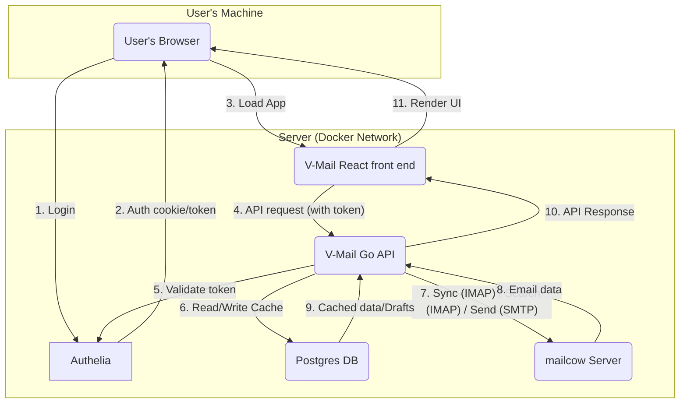

# Architecture

Here are some clues that should help you get started.

## Component interaction diagram

Here is a high-level overview of the interaction between V-Mail's components:



## Directory structure

```
/backend
├── /cmd/
│   └── /server/
│       └── main.go           # Main entry point
├── /internal/
│   ├── /api/                 # HTTP Handlers & routing
│   ├── /auth/                # Middleware for validating Authelia JWTs
│   ├── /config/              # Config loading (env vars, etc.)
│   ├── /crypto/              # Encryption/decryption logic
│   ├── /db/                  # Postgres access
│   ├── /imap/                # Core IMAP service logic
│   ├── /models/              # Core structs (Thread, Message, User)
│   └── /sync/                # Logic for background jobs, action_queue
│   └── /testutil/            # Test utilities and mocks
├── /migrations/              # DB migrations
├── go.mod
├── go.sum
└── Dockerfile
```

## DB

We chose **Postgres** for its robustness, reliability, and excellent support for `JSONB`,
which is useful for flexible payloads like our action queue.

The DB's role is **not** to be a full, permanent copy of the mailbox. Its primary roles are:

* Caching thread/message metadata for a fast UI.
* Storing user settings and their **encrypted** IMAP/SMTP credentials.
* Saving drafts.
* Queuing actions (like "Undo Send" or offline operations).

## Back end

The back end is a **Go** application providing a **REST API** for the front end.
It communicates with the IMAP and the SMTP server and uses a **Postgres** database for caching and internal storage.

### Features

- [auth](backend/auth.md)
- [config](backend/config.md)
- [crypto](backend/crypto.md)
- [folders](backend/folders.md)
- [imap](backend/imap.md)
- [search](backend/search.md)
- [settings](backend/settings.md)
- [thread](backend/thread.md)
- [threads](backend/threads.md)

### REST API

**Base path:** `/api/v1`

**Thread ID:** The `thread_id` we use in the API (e.g., `/api/v1/thread/{thread_id}`) is a stable,
unique identifier, such as the `Message-ID` header of the root/first message in the thread.

(The checked items are implemented)

* [x] `GET /auth/status`: Checks the Authelia token and tells the front end if the user has
  completed the setup/onboarding.
    * Response: `{"isSetupComplete": false}`.
    * `isSetupComplete: false` tells the React app to redirect to the `/settings` page for onboarding.
* [x] `GET /folders`: List all IMAP folders (Inbox, Sent, etc.).
    * Response: Array of folder objects with `name` and `role` fields.
    * Folders are sorted by role priority (inbox, sent, drafts, spam, trash, archive, other), then alphabetically within the same role.
* [x] `GET /threads?folder=Inbox&page=1&limit=100`: Get paginated threads for a folder.
    * Response: `{"threads": [...], "pagination": {"total_count": 100, "page": 1, "per_page": 100}}`.
    * Automatically syncs the folder from IMAP if the cache is stale.
    * Uses user's pagination setting from settings if no limit is provided.
* [x] `GET /search?q=from:george&page=1&limit=100`: Get paginated search results.
    * Response: `{"threads": [...], "pagination": {"total_count": 100, "page": 1, "per_page": 100}}`.
    * Supports Gmail-like search syntax (from:, to:, subject:, after:, before:, folder:, label:).
    * Empty query returns all emails in INBOX.
    * Uses user's pagination setting from settings if no limit is provided.
* [x] `GET /thread/{thread_id}`: Get all messages and content for one thread.
    * Response: Thread object with all messages, attachments, and bodies.
    * Automatically syncs missing message bodies from IMAP in batch.
    * Thread ID is URL-encoded Message-ID header.
* [ ] `GET /message/{message_id}/attachment/{attachment_id}`: Download an attachment.
* [x] `GET /settings`: Get user settings.
    * Response: `{"imap_server_hostname": "mail.example.com", "archive_folder_name": "Archive", ...}`
    * It should **not** return the encrypted passwords.
* [ ] `POST /send`: Send a new email (places in `action_queue` for "Undo Send").
* [ ] `POST /drafts`: Create or update a draft.
* [ ] `POST /actions`: Perform bulk actions.
    * Body: `{"action": "archive", "thread_ids": ["id1", "id2"]}`
    * Body: `{"action": "mark_read", "message_ids": ["id3"]}`
    * Body: `{"action": "star", "thread_ids": ["id1"]}`
* [ ] `POST /undo`: Undo the last `send` action.
* [x] `POST /settings`: Save settings.
    * Body:
      `{"imap_server_hostname": "imap.example.com", "imap_username": "user", "imap_password": "pass", "smtp_server_hostname": "smtp.example.com", "smtp_username": "user", "smtp_password": "pass", "undo_send_delay_seconds": 20, "pagination_threads_per_page": 100}`
    * Response: `200 OK`
* [ ] `DELETE /threads`: Move threads to trash.
    * Body: `{"thread_ids": ["id1", "id2"]}`

### Real-time API (WebSockets)

For real-time updates (like new emails), the front end will open a WebSocket connection.

* [ ] `GET /api/v1/ws`: Upgrades the HTTP connection to a WebSocket.
  The server uses this connection to push updates to the client.
    * **Server-to-client message example:**
        ```json
        {"type": "new_message", "folder": "INBOX"}
        ```

### Technical decisions

See [technical decisions](technical-decisions.md)