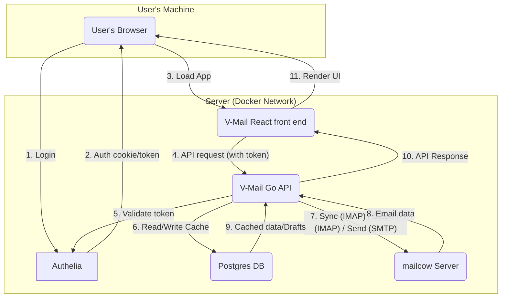

# Architecture

Here are some clues that should help you get started.

## Component interaction diagram

Here is a high-level overview of the interaction between V-Mail's components:



## Directory structure

```
/backend
├── /cmd/
│   └── /server/
│       └── main.go           # Main entry point
├── /internal/
│   ├── /api/                 # HTTP Handlers & routing
│   ├── /auth/                # Middleware for validating Authelia JWTs
│   ├── /config/              # Config loading (env vars, etc.)
│   ├── /crypto/              # Encryption/decryption logic
│   ├── /db/                  # Postgres access
│   ├── /imap/                # Core IMAP service logic
│   ├── /models/              # Core structs (Thread, Message, User)
│   └── /sync/                # Logic for background jobs, action_queue
│   └── /testutil/            # Test utilities and mocks
├── /migrations/              # DB migrations
├── go.mod
├── go.sum
└── Dockerfile
```

## DB

We chose **Postgres** for its robustness, reliability, and excellent support for `JSONB`,
which is useful for flexible payloads like our action queue.

The DB's role is **not** to be a full, permanent copy of the mailbox. Its primary roles are:

* Caching thread/message metadata for a fast UI.
* Storing user settings and their **encrypted** IMAP/SMTP credentials.
* Saving drafts.
* Queuing actions (like "Undo Send" or offline operations).

## Back end

The back end is a **Go** application providing a **REST API** for the front end.
It communicates with the IMAP and the SMTP server and uses a **Postgres** database for caching and internal storage.

### Go libraries used

* **IMAP Client:** [`github.com/emersion/go-imap`](https://github.com/emersion/go-imap)
    * This seems to be the *de facto* standard library for client-side IMAP in Go.
      It seems well-maintained and supports the necessary extensions like `THREAD`.
* **MIME Parsing:** [`github.com/jhillyerd/enmime`](https://github.com/jhillyerd/enmime)
    * The Go standard library is not enough for real-world, complex emails.
    * `enmime` robustly handles attachments, encodings,
      and HTML/text parts. [Docs here.](https://pkg.go.dev/github.com/jhillyerd/enmime)
* **SMTP Sending:** Standard `net/smtp` (for transport)
  with [`github.com/go-mail/mail`](https://github.com/go-mail/mail)
    * `net/smtp` is the standard library for sending.
    * `go-mail` is a popular and simple builder library for composing complex emails (HTML and attachments)
      that `net/smtp` can then send.
* **HTTP Router:** [`http.ServeMux`](https://pkg.go.dev/net/http#ServeMux)
    * It's part of the Go standard library, is battle-tested and well-documented.
    * Selected based on [this guide](https://www.alexedwards.net/blog/which-go-router-should-i-use)
* **Postgres Driver:** [`github.com/jackc/pgx`](https://github.com/jackc/pgx)
    * The modern, high-performance Postgres driver for Go. We need no full ORM (like [GORM](https://gorm.io/))
      for this project.
* **Encryption:** Standard `crypto/aes` and `crypto/cipher`
    * For encrypting/decrypting user credentials in the DB using AES-GCM.
* **Testing:** [`github.com/ory/dockertest`](https://github.com/ory/dockertest)
    * Useful for integration tests to spin up real Postgres containers.

### Domains

#### IMAP

The IMAP domain handles all communication with IMAP servers, including connection pooling, folder listing, message syncing, and searching.

**Components:**

* **`internal/imap/client.go`**: Connection pool implementation.
  * `Pool`: Manages IMAP connections per user (one connection per user, reused across requests).
  * `getClientConcrete`: Gets or creates an IMAP client, checking connection health.
  * `GetClient`: Public interface that returns an `IMAPClient` wrapper.
  * `RemoveClient`: Removes a broken connection from the pool.
  * `ConnectToIMAP`: Establishes connection with 5-second timeout.
  * `Login`: Authenticates with the IMAP server.

* **`internal/imap/pool_interface.go`**: Interfaces for testability.
  * `IMAPClient`: Interface for IMAP client operations (currently only `ListFolders`).
  * `IMAPPool`: Interface for connection pool operations.
  * `ClientWrapper`: Wraps go-imap client to implement `IMAPClient`.

* **`internal/imap/service.go`**: Main IMAP service implementation.
  * `Service`: Handles IMAP operations and caching.
  * `SyncThreadsForFolder`: Syncs threads from IMAP (incremental or full sync).
  * `SyncFullMessage`: Syncs a single message body.
  * `SyncFullMessages`: Batch syncs multiple message bodies.
  * `Search`: Searches for threads matching a query.
  * `ShouldSyncFolder`: Checks if folder cache is stale.

* **`internal/imap/fetch.go`**: Message fetching operations.
  * `FetchMessageHeaders`: Fetches headers for multiple messages.
  * `FetchFullMessage`: Fetches full message body.
  * `SearchUIDsSince`: Searches for UIDs >= minUID (for incremental sync).

* **`internal/imap/folder.go`**: Folder listing operations.
  * `ListFolders`: Lists folders with SPECIAL-USE attributes.
  * `determineFolderRole`: Maps folder names and attributes to roles.

* **`internal/imap/thread.go`**: Thread structure operations.
  * `RunThreadCommand`: Executes IMAP THREAD command.

* **`internal/imap/parser.go`**: Message parsing.
  * `ParseMessage`: Converts IMAP message to internal model.
  * `parseBody`: Parses email body using enmime library.

* **`internal/imap/search.go`**: Search query parsing and execution.
  * `ParseSearchQuery`: Parses Gmail-like search queries.
  * `Search`: Performs IMAP search and returns threads.

**Connection Pooling:**

The connection pool is a critical and complex part of the codebase. Key characteristics:

* **Worker connections**: Each user has a pool of 1-3 worker connections for API handlers (SEARCH, FETCH, STORE). These connections are reused across requests and managed by a semaphore to limit concurrent connections.
* **Listener connections**: Each user has one dedicated listener connection for the IDLE command (for real-time email notifications via WebSocket).
* **Thread safety**: 
  * IMAP clients from `go-imap` are **NOT thread-safe**. Each connection is wrapped with a mutex (`clientWithMutex`) to ensure thread-safe access.
  * Multiple goroutines can use different connections concurrently, but access to the same connection is serialized by the mutex.
  * Folder selection is thread-safe because connections are locked during operations.
* **Connection lifecycle management**:
  * **Idle timeout**: Worker connections are closed after 10 minutes of inactivity. Listener connections have no idle timeout (IDLE keeps them alive).
  * **Health checks**: Before reusing a connection that's been idle > 1 minute, a NOOP command is sent to verify the connection is alive.
  * **Automatic cleanup**: A background goroutine runs every minute to remove idle connections.
* **Connection limits**: Maximum of 3 worker connections per user (enforced by semaphore). One listener connection per user.

**Thread safety guarantees:**

* **Per-connection mutexes**: Each connection has its own mutex, allowing concurrent access to different connections while serializing access to the same connection.
* **Double-check locking**: Used when creating new connections to prevent race conditions where multiple goroutines create connections simultaneously.
* **Semaphore-based limiting**: Worker connections are limited by a semaphore (max 3 per user), ensuring proper resource management.

**Sync behavior:**

* **Incremental sync**: If a folder has been synced before, only new messages (UIDs > last synced UID) are fetched.
* **Full sync**: If no sync info exists or incremental sync fails, all messages are fetched using THREAD command (or SEARCH as fallback).
* **Thread structure**: Full sync uses IMAP THREAD command to build thread relationships. If THREAD is not supported, falls back to processing messages without threading.
* **Lazy loading**: Message bodies are not always synced immediately. They are synced on-demand when a thread is viewed.

**Error handling:**

* Sync errors are logged but don't fail requests (graceful degradation).
* Broken connections are removed from the pool and recreated on next use.
* Folder selection errors are propagated to the caller.
* Network errors during fetch are propagated to the caller.

### Domains

#### Config

The config package handles loading and validating application configuration from environment variables.

**Components:**

* **`internal/config/config.go`**: Configuration loading and validation.
  * `Config`: Struct holding all application configuration values.
  * `NewConfig`: Loads configuration from environment variables, with support for `.env` file in development mode.
  * `Validate`: Validates that all required configuration values are set.
  * `GetDatabaseURL`: Builds a PostgreSQL connection string from database configuration.
  * `getEnvOrDefault`: Helper function to get environment variables with default values.

**Configuration values:**

* **Required:**
  * `VMAIL_ENCRYPTION_KEY_BASE64`: Base64-encoded encryption key (32 bytes when decoded).
  * `AUTHELIA_URL`: Base URL of the Authelia authentication server.
  * `VMAIL_DB_PASSWORD`: PostgreSQL database password.

* **Optional (with defaults):**
  * `VMAIL_ENV`: Deployment environment (defaults to "development").
  * `VMAIL_DB_HOST`: Database hostname (defaults to "localhost").
  * `VMAIL_DB_PORT`: Database port (defaults to "5432").
  * `VMAIL_DB_USER`: Database username (defaults to "vmail").
  * `VMAIL_DB_NAME`: Database name (defaults to "vmail").
  * `VMAIL_DB_SSLMODE`: SSL mode (defaults to "disable").
  * `PORT`: HTTP server port (defaults to "11764").
  * `TZ`: Application timezone (defaults to "UTC").

**Development mode:**

* When `VMAIL_ENV` is "development" (or not set), the package attempts to load a `.env` file using `godotenv`.
* If the `.env` file is not found, it falls back to environment variables with a warning message.

**Current limitations:**

* None - all identified issues have been addressed.

#### Crypto

The crypto package provides encryption and decryption functionality for sensitive data like user passwords.

**Components:**

* **`internal/crypto/encryption.go`**: AES-GCM encryption implementation.
  * `Encryptor`: Struct holding the encryption key.
  * `NewEncryptor`: Creates a new encryptor from a base64-encoded 32-byte key.
  * `Encrypt`: Encrypts plaintext using AES-GCM with a random nonce.
  * `Decrypt`: Decrypts ciphertext, verifying authenticity and integrity.

**Encryption scheme:**

* **Algorithm:** AES-256-GCM (Galois/Counter Mode)
* **Key size:** 32 bytes (256 bits)
* **Nonce:** Randomly generated for each encryption (12 bytes for GCM)
* **Ciphertext format:** `[nonce][encrypted_data][auth_tag]`
  * The nonce is prepended to the ciphertext for use during decryption.
  * The authentication tag is appended by GCM to verify data integrity.

**Security properties:**

* **Confidentiality:** Data is encrypted and cannot be read without the key.
* **Authenticity:** GCM provides authentication, detecting tampering or corruption.
* **Nonce uniqueness:** Each encryption uses a random nonce, ensuring the same plaintext produces different ciphertexts.
* **Key storage:** The encryption key is stored in memory as plain bytes (standard practice for application-level encryption).

**Usage:**

* Used to encrypt/decrypt IMAP and SMTP passwords before storing them in the database.
* The encryption key is provided via the `VMAIL_ENCRYPTION_KEY_BASE64` environment variable.
* The same key must be used across all application instances to decrypt previously encrypted data.

#### Auth

The auth domain handles authentication and authorization for the V-Mail API.

**Components:**

* **`internal/api/auth_handler.go`**: HTTP handler for the `/api/v1/auth/status` endpoint.
  * `GetAuthStatus`: Returns authentication and setup status for the current user.
  * Checks if the user has completed onboarding by verifying user settings exist in the database.

* **`internal/auth/middleware.go`**: Authentication middleware.
  * `RequireAuth`: HTTP middleware that validates Bearer tokens in the Authorization header.
  * `ValidateToken`: Validates Authelia JWT tokens and extracts the user's email (currently a stub for development).
  * `GetUserEmailFromContext`: Helper to extract the authenticated user's email from the request context.

* **`internal/db/user.go`**: Database operations for users.
  * `GetOrCreateUser`: Gets or creates a user record by email address.

* **`internal/db/user_settings.go`**: Database operations for user settings.
  * `UserSettingsExist`: Checks if user settings exist for a given user ID.

**Flow:**

1. Frontend sends API requests with a Bearer token in the Authorization header.
2. `RequireAuth` middleware validates the token and extracts the user's email.
3. The email is stored in the request context for use by handlers.
4. Handlers use `GetUserEmailFromContext` to retrieve the authenticated user's email.
5. The auth handler checks if the user has completed setup by querying for user settings.

**Current limitations:**

* `ValidateToken` is a stub that always returns "test@example.com" in production mode. It must be implemented to actually validate Authelia JWT tokens before deployment.
* In test mode (`VMAIL_TEST_MODE=true`), tokens can be prefixed with "email:" to specify the test user email.

#### Folders

The folders domain handles listing IMAP folders for the authenticated user.

**Components:**

* **`internal/api/folders_handler.go`**: HTTP handler for the `/api/v1/folders` endpoint.
  * `GetFolders`: Lists all IMAP folders for the current user, sorted by role priority.
  * `getUserSettingsAndPassword`: Retrieves user settings and decrypts the IMAP password.
  * `getIMAPClient`: Gets an IMAP client from the pool, with user-friendly error messages for timeouts.
  * `listFoldersWithRetry`: Lists folders with automatic retry on connection errors.
  * `retryListFolders`: Retries listing folders after removing a broken connection from the pool.
  * `writeFoldersResponse`: Writes the sorted folders as JSON.
  * `sortFoldersByRole`: Sorts folders by role priority (inbox, sent, drafts, spam, trash, archive, other), then alphabetically within the same role.

* **`internal/imap/folder.go`**: IMAP folder listing implementation.
  * `ListFolders`: Lists all folders on the IMAP server using SPECIAL-USE attributes (RFC 6154) to determine roles.
  * `determineFolderRole`: Maps folder names and SPECIAL-USE attributes to role strings.

**Flow:**

1. Handler extracts user ID from request context.
2. Retrieves and decrypts user settings (IMAP credentials).
3. Gets an IMAP client from the connection pool.
4. Lists folders from the IMAP server.
5. If a connection error occurs (broken pipe, connection reset, EOF), removes the broken client from the pool and retries with a fresh connection.
6. Sorts folders by role priority and alphabetically.
7. Returns folders as JSON.

**Error handling:**

* Returns 404 if user settings are not found.
* Returns 400 if the IMAP server doesn't support SPECIAL-USE extension (required for V-Mail).
* Returns 503 (Service Unavailable) for connection timeout errors with a user-friendly message.
* Returns 500 for other connection or internal errors.
* Automatically retries on transient connection errors (broken pipe, connection reset, EOF).

**Dependencies:**

* Requires IMAP server support for SPECIAL-USE extension (RFC 6154) to identify folder roles.
* Uses the IMAP connection pool to manage client connections efficiently.

#### Threads

The threads domain handles listing email threads for a folder with pagination support.

**Components:**

* **`internal/api/threads_handler.go`**: HTTP handler for the `/api/v1/threads` endpoint.
  * `GetThreads`: Returns a paginated list of email threads for a folder.
  * `parsePaginationParams`: Parses page and limit query parameters with validation.
  * `getPaginationLimit`: Gets pagination limit from user settings or defaults.
  * `syncFolderIfNeeded`: Checks if folder needs syncing and syncs if necessary.
  * `buildPaginationResponse`: Builds the paginated response structure.

* **`internal/db/threads.go`**: Database operations for threads.
  * `GetThreadsForFolder`: Retrieves paginated threads for a folder.
  * `GetThreadCountForFolder`: Gets the total count of threads for pagination.
  * `SaveThread`: Saves or updates a thread in the database.

**Flow:**

1. Handler extracts user ID from request context.
2. Validates that the `folder` query parameter is provided.
3. Parses pagination parameters (page, limit) from query string.
4. Gets pagination limit from user settings if not provided in query.
5. Checks if folder needs syncing and syncs from IMAP if stale.
6. Retrieves threads from the database with pagination.
7. Gets total thread count for pagination metadata.
8. Returns paginated response with threads and pagination info.

**Pagination:**

* Default page: 1
* Default limit: User's setting from `PaginationThreadsPerPage`, or 100 if not set.
* Query parameters: `page` and `limit` can override defaults.
* Invalid values (non-positive numbers) fall back to defaults.

**Sync behavior:**

* Automatically checks if folder cache is stale before returning threads.
* If stale, syncs from IMAP server in the background.
* If sync fails, continues and returns cached data (graceful degradation).
* Sync errors are logged but don't fail the request.

**Error handling:**

* Returns 400 if folder parameter is missing.
* Returns 500 for database errors (getting threads or count).
* Returns 500 for JSON encoding errors.

#### Search

The search domain handles searching for email threads using Gmail-like query syntax.

**Components:**

* **`internal/api/search_handler.go`**: HTTP handler for the `/api/v1/search` endpoint.
  * `Search`: Handles search requests with query parameter parsing and pagination.
  * `getPaginationLimit`: Gets pagination limit from user settings or defaults.

* **`internal/imap/search.go`**: IMAP search implementation and query parsing.
  * `ParseSearchQuery`: Parses Gmail-like search queries into IMAP SearchCriteria.
  * `Search`: Performs IMAP search and returns paginated threads.
  * `buildThreadMapFromMessages`: Builds thread map from IMAP search results.
  * `sortAndPaginateThreads`: Sorts threads by latest sent_at and applies pagination.
  * `tokenizeQuery`: Tokenizes query string, respecting quoted strings.
  * `parseHeaderFilter`: Parses header filters (from:, to:, subject:).
  * `parseDateFilter`: Parses date filters (after:, before:).
  * `parseFolderFilter`: Parses folder/label filters (folder:, label:).

**Flow:**

1. Handler extracts user ID from request context.
2. Gets query from `q` query parameter (empty query means return all emails).
3. Parses pagination parameters (page, limit) from query string.
4. Gets pagination limit from user settings if not provided in query.
5. Calls IMAP service to search for matching threads.
6. IMAP service parses query using Gmail-like syntax.
7. IMAP service searches the specified folder (or INBOX if not specified).
8. IMAP service fetches message headers for matching UIDs.
9. IMAP service builds thread map from messages in the database.
10. IMAP service sorts threads by latest sent_at and applies pagination.
11. IMAP service enriches threads with first message's from_address.
12. Returns paginated response with threads and pagination info.

**Search syntax:**

* **Header filters:**
  * `from:george` - Search by sender
  * `to:alice` - Search by recipient
  * `subject:meeting` - Search by subject
  * Quoted values: `from:"John Doe"` - Search with quoted strings

* **Date filters:**
  * `after:2025-01-01` - Messages after date (YYYY-MM-DD format)
  * `before:2025-12-31` - Messages before date (end of day)

* **Folder filters:**
  * `folder:Inbox` - Search in specific folder
  * `label:Sent` - Alias for folder: (Gmail compatibility)

* **Plain text:**
  * `cabbage` - Full-text search across message content

* **Combinations:**
  * `from:george after:2025-01-01 cabbage` - Multiple filters and text search

**Pagination:**

* Default page: 1
* Default limit: User's setting from `PaginationThreadsPerPage`, or 100 if not set.
* Query parameters: `page` and `limit` can override defaults.
* Invalid values (non-positive numbers) fall back to defaults.

**Error handling:**

* Returns 400 for invalid query syntax (e.g., empty filter values, invalid date formats).
* Returns 500 for IMAP connection errors, search failures, or database errors.
* Returns 500 for JSON encoding errors.
* If thread enrichment fails, continues gracefully (threads work without from_address).

**Current limitations:**

* Search is limited to a single folder (defaults to INBOX if not specified).
* Full-text search uses IMAP's TEXT search criteria (server-dependent behavior).
* Threads are sorted by latest sent_at only (no other sort options).

#### Thread

The thread domain handles retrieving a single email thread with all its messages, attachments, and bodies.

**Components:**

* **`internal/api/thread_handler.go`**: HTTP handler for the `/api/v1/thread/{thread_id}` endpoint.
  * `GetThread`: Returns a single thread with all messages, attachments, and bodies.
  * `getStableThreadIDFromPath`: Extracts and URL-decodes the thread ID from the request path.
  * `collectMessagesToSync`: Identifies messages that need body syncing (lazy loading).
  * `syncMissingBodies`: Syncs missing message bodies from IMAP in batch.
  * `assignAttachments`: Assigns batch-fetched attachments to messages.
  * `convertMessagesToThreadMessages`: Converts messages for response, ensuring attachments are never nil.

* **`internal/db/messages.go`**: Database operations for messages and attachments.
  * `GetMessagesForThread`: Retrieves all messages for a thread, ordered by sent_at.
  * `GetMessageByUID`: Retrieves a message by IMAP UID and folder.
  * `GetAttachmentsForMessages`: Batch-fetches attachments for multiple messages (avoids N+1 queries).

**Flow:**

1. Handler extracts user ID from request context.
2. Extracts and URL-decodes thread ID from the request path.
3. Retrieves thread from database by stable thread ID.
4. Retrieves all messages for the thread.
5. Batch-fetches all attachments for the messages (single query).
6. Identifies messages with missing bodies (lazy loading optimization).
7. Syncs missing bodies from IMAP in batch if needed.
8. Re-fetches synced messages to get updated bodies.
9. Assigns attachments to messages and converts for response.
10. Returns thread with all messages, attachments, and bodies.

**Lazy loading:**

* Message bodies are not always synced immediately when threads are synced.
* Bodies are synced on-demand when a thread is viewed.
* This optimization reduces initial sync time and storage requirements.
* Bodies are synced in batch for efficiency.

**Error handling:**

* Returns 400 if thread_id is missing or invalid.
* Returns 404 if thread is not found.
* Returns 500 for database errors.
* If attachment fetching fails, continues with empty attachments.
* If body sync fails, continues with messages without bodies (graceful degradation).
* Returns 500 for JSON encoding errors.

**Performance optimizations:**

* Batch-fetches attachments in a single query (avoids N+1 queries).
* Batch-syncs missing message bodies.
* Uses efficient UID-to-index mapping for updating synced messages.

#### Settings

The settings domain handles user settings management, including IMAP/SMTP credentials and application preferences.

**Components:**

* **`internal/api/settings_handler.go`**: HTTP handlers for the `/api/v1/settings` endpoint.
  * `GetSettings`: Returns user settings for the current user (passwords are never included, only a boolean indicating if they're set).
  * `PostSettings`: Saves or updates user settings. Passwords are optional on update (empty passwords preserve existing ones), but required for initial setup.
  * `validateSettingsRequest`: Validates that all required fields are present in the request.

* **`internal/db/user_settings.go`**: Database operations for user settings.
  * `GetUserSettings`: Retrieves user settings by user ID.
  * `SaveUserSettings`: Saves or updates user settings (uses ON CONFLICT for upsert).
  * `UserSettingsExist`: Checks if user settings exist for a given user ID.

**Flow (GetSettings):**

1. Handler extracts user ID from request context.
2. Retrieves user settings from the database.
3. Returns 404 if settings don't exist.
4. Builds response without passwords (only indicates if they're set).
5. Returns settings as JSON.

**Flow (PostSettings):**

1. Handler extracts user ID from request context.
2. Decodes and validates the request body.
3. Retrieves existing settings (if any) to preserve passwords.
4. Handles password encryption:
   * If password is provided: encrypts and uses the new password.
   * If password is empty and settings exist: preserves existing encrypted password.
   * If password is empty and no settings exist: returns 400 (password required for initial setup).
5. Saves settings to the database.
6. Returns success response.

**Security:**

* Passwords are encrypted using AES-GCM before storage in the database.
* Passwords are never returned in API responses (only a boolean indicating if they're set).
* Passwords can be updated without re-entering other passwords.

**Error handling:**

* Returns 404 if settings are not found (GetSettings).
* Returns 400 for validation errors (missing required fields, empty passwords on initial setup).
* Returns 500 for database or encryption errors.

### REST API

**Base path:** `/api/v1`

**Thread ID:** The `thread_id` we use in the API (e.g., `/api/v1/thread/{thread_id}`) is a stable,
unique identifier, such as the `Message-ID` header of the root/first message in the thread.

(The checked items are implemented)

* [x] `GET /auth/status`: Checks the Authelia token and tells the front end if the user has
  completed the setup/onboarding.
    * Response: `{"isSetupComplete": false}`.
    * `isSetupComplete: false` tells the React app to redirect to the `/settings` page for onboarding.
* [x] `GET /folders`: List all IMAP folders (Inbox, Sent, etc.).
    * Response: Array of folder objects with `name` and `role` fields.
    * Folders are sorted by role priority (inbox, sent, drafts, spam, trash, archive, other), then alphabetically within the same role.
* [x] `GET /threads?folder=Inbox&page=1&limit=100`: Get paginated threads for a folder.
    * Response: `{"threads": [...], "pagination": {"total_count": 100, "page": 1, "per_page": 100}}`.
    * Automatically syncs the folder from IMAP if the cache is stale.
    * Uses user's pagination setting from settings if no limit is provided.
* [x] `GET /search?q=from:george&page=1&limit=100`: Get paginated search results.
    * Response: `{"threads": [...], "pagination": {"total_count": 100, "page": 1, "per_page": 100}}`.
    * Supports Gmail-like search syntax (from:, to:, subject:, after:, before:, folder:, label:).
    * Empty query returns all emails in INBOX.
    * Uses user's pagination setting from settings if no limit is provided.
* [x] `GET /thread/{thread_id}`: Get all messages and content for one thread.
    * Response: Thread object with all messages, attachments, and bodies.
    * Automatically syncs missing message bodies from IMAP in batch.
    * Thread ID is URL-encoded Message-ID header.
* [ ] `GET /message/{message_id}/attachment/{attachment_id}`: Download an attachment.
* [x] `GET /settings`: Get user settings.
    * Response: `{"imap_server_hostname": "mail.example.com", "archive_folder_name": "Archive", ...}`
    * It should **not** return the encrypted passwords.
* [ ] `POST /send`: Send a new email (places in `action_queue` for "Undo Send").
* [ ] `POST /drafts`: Create or update a draft.
* [ ] `POST /actions`: Perform bulk actions.
    * Body: `{"action": "archive", "thread_ids": ["id1", "id2"]}`
    * Body: `{"action": "mark_read", "message_ids": ["id3"]}`
    * Body: `{"action": "star", "thread_ids": ["id1"]}`
* [ ] `POST /undo`: Undo the last `send` action.
* [x] `POST /settings`: Save settings.
    * Body:
      `{"imap_server_hostname": "imap.example.com", "imap_username": "user", "imap_password": "pass", "smtp_server_hostname": "smtp.example.com", "smtp_username": "user", "smtp_password": "pass", "undo_send_delay_seconds": 20, "pagination_threads_per_page": 100}`
    * Response: `200 OK`
* [ ] `DELETE /threads`: Move threads to trash.
    * Body: `{"thread_ids": ["id1", "id2"]}`

### Real-time API (WebSockets)

For real-time updates (like new emails), the front end will open a WebSocket connection.

* `GET /api/v1/ws`: Upgrades the HTTP connection to a WebSocket.
  The server uses this connection to push updates to the client.
    * **Server-to-client message example:**
        ```json
        {"type": "new_message", "folder": "INBOX"}
        ```

## Front end

### Tech

* **Framework:** React 19+, with functional components and hooks.
* **Language:** TypeScript, using no classes, just modules.
* **Styling:** Tailwind 4, utility-first CSS.
* **Package manager:** pnpm.
* **State management:**
    * `TanStack Query` (React Query): For server state (caching, invalidating, and refetching all data from our Go API).
    * `Zustand`: For simple, global UI state (e.g., current selection, composer open/closed).
* **Routing:** `react-router` (for URL-based navigation, e.g., `/inbox`, `/thread/id`).
* **Linting/Formatting:** ESLint and Prettier.
* **Testing:**
    * `Jest` + `React Testing Library`: For unit and integration tests.
    * `Playwright`: For end-to-end tests.
* **Security:** [`DOMPurify`](https://github.com/cure53/DOMPurify)
    * To sanitize all email HTML content before rendering it with `dangerouslySetInnerHTML`.
      This is a **mandatory** security step.
